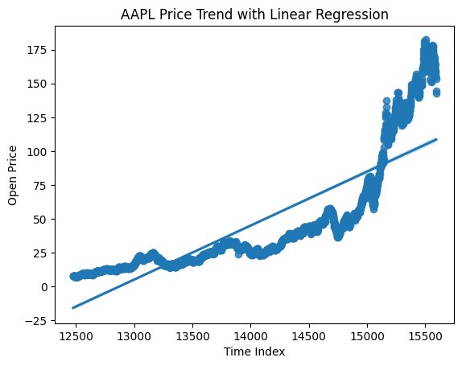
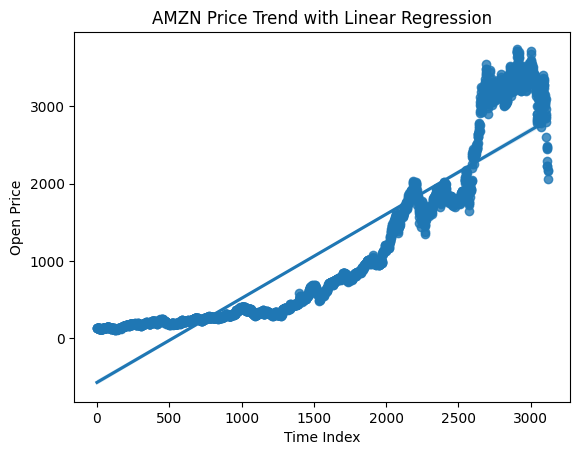

# Stock-market-management-project
We have designed a stock trading system with the following features in this project.

1 - Buy stocks.

 2 - Selling stocks.

3 - Viewing a list of available stocks with their price change percentage.

 4 - View the purchased stocks and the total value of your shares.

 5 - Selecting a stock and viewing its price change chart.

6 - See the general trend of price changes using linear regression.

